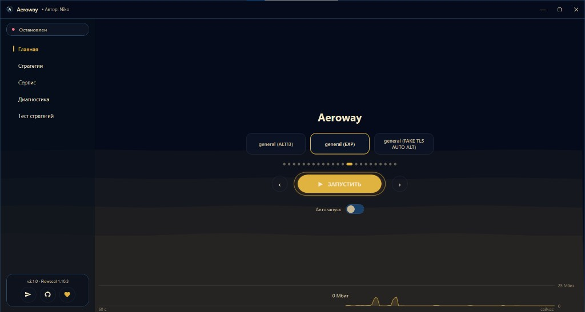

  

<h1 align="center">Aeroway</h1>

<strong>Программа, которая одной кнопкой открывает Discord, YouTube и другие сервисы на Windows.</strong>

  
  
  
  

  
  &nbsp;
  

Удобная оболочка для конфигов [Flowseal/zapret-discord-youtube](https://github.com/Flowseal/zapret-discord-youtube) и движка [zapret](https://github.com/bol-van/zapret) (`winws`). Не нужно разбираться в командной строке: выбрали стратегию и нажали **Запустить**.

Раньше программа называлась Zapret UI. Уже установленная версия обновляется сама.

Новости и вопросы — в [Telegram-канале Aeroway](https://t.me/AerowayUI).

  
   
  <em>Главный экран</em>

> Инструмент для исследовательских и образовательных целей. Используйте по законам своей страны.

---

## Документация

Короткая выжимка — ниже. Подробная установка, антивирус и брандмауэр — на [сайте руководства](https://raccoonlaptop.github.io/Aeroway/). Там же русский и English.

| | |
|---|---|
| [Скачать](https://github.com/RaccoonLaptop/Aeroway/releases/latest) | Установщик `Aeroway-Setup.exe`, .NET ставить не нужно |
| [Руководство](https://raccoonlaptop.github.io/Aeroway/) | Быстрый старт, интерфейс, если не работает, файлы и удаление |
| [Донат](https://raccoonlaptop.github.io/Aeroway/donate.html) | Сумму указываете сами, оплата через ЮKassa |
| [Telegram](https://t.me/AerowayUI) | Канал с новостями и вопросами |

---

## Содержание

- [Что это](#что-это)
- [Что умеет программа](#что-умеет-программа)
- [Быстрый старт](#быстрый-старт)
- [Интерфейс](#интерфейс)
- [Поддержать](#поддержать)
- [Благодарности](#благодарности)

---

## Что это

Aeroway запускает готовые стратегии Flowseal поверх обычного zapret (`winws`). Это не zapret2 и не `winws2`: конфиги от нового движка сюда не подходят.

Интерфейс на русском и английском. Программа открывается от имени администратора: Windows спрашивает разрешение один раз при запуске, а не при каждом включении обхода.

---

## Что умеет программа

- **Запуск одной кнопкой** на главном экране и из системного трея.
- **Готовые стратегии Flowseal** и свои `.bat`.
- **Редактор стратегий и списков**, Game Filter и IPSet.
- **Тест стратегий** — лучший пресет можно поставить на главную.
- **Диагностика** файлов обхода перед запуском.
- **Автообновление** программы и компонентов Flowseal. Установка — после подтверждения.
- **Автозапуск** в трее при входе в Windows.
- **Свои файлы сохраняются** при обновлении Flowseal. Есть экспорт и импорт.

---

## Быстрый старт

1. Скачайте и установите [Aeroway-Setup.exe](https://github.com/RaccoonLaptop/Aeroway/releases/latest).
2. При первом запуске дождитесь загрузки компонентов Flowseal.
3. Добавьте папку `%LOCALAPPDATA%\Aeroway` в исключения антивируса и разрешите `Aeroway.exe` и `winws.exe` в брандмауэре. По шагам — в [руководстве](https://raccoonlaptop.github.io/Aeroway/).
4. При запуске программы согласитесь с запросом Windows. Затем на главной выберите стратегию и нажмите **Запустить**.

Зелёная иконка в трее — обход работает. Синяя — остановлен. Правый клик: статус, запуск, остановка, открыть окно, выход.

---

## Интерфейс

| Раздел | Что там |
|---|---|
| **Главная** | Выбор стратегии, кнопка запуска, автозапуск, статус |
| **Стратегии** | Редактор `.bat`, списки, свои конфиги |
| **Сервис** | Game Filter, IPSet, язык, обновления Flowseal и программы |
| **Диагностика** | Проверка `winws.exe` и WinDivert, журнал |
| **Тест стратегий** | Прогон пресетов и выбор лучшего на главную |

Снизу меню — кнопки Telegram, GitHub и Донат. Справа внизу — переключатель анимации фона.

Если обход не запускается или нужно удалить программу, это разобрано в [руководстве](https://raccoonlaptop.github.io/Aeroway/).

---

## Поддержать

Если программа пригодилась:

- [поставьте звезду](https://github.com/RaccoonLaptop/Aeroway) на этой странице;
- [поддержите проект](https://raccoonlaptop.github.io/Aeroway/donate.html) — сумму указываете сами, оплата через ЮKassa;
- напишите в [Telegram](https://t.me/AerowayUI), какая стратегия заработала у вашего провайдера.

---

## Благодарности

- [bol-van/zapret](https://github.com/bol-van/zapret) — движок обхода DPI (`winws`).
- [Flowseal/zapret-discord-youtube](https://github.com/Flowseal/zapret-discord-youtube) — стратегии и списки.

## Лицензия

MIT, см. [LICENSE](LICENSE). Движок zapret распространяется по своей лицензии.
